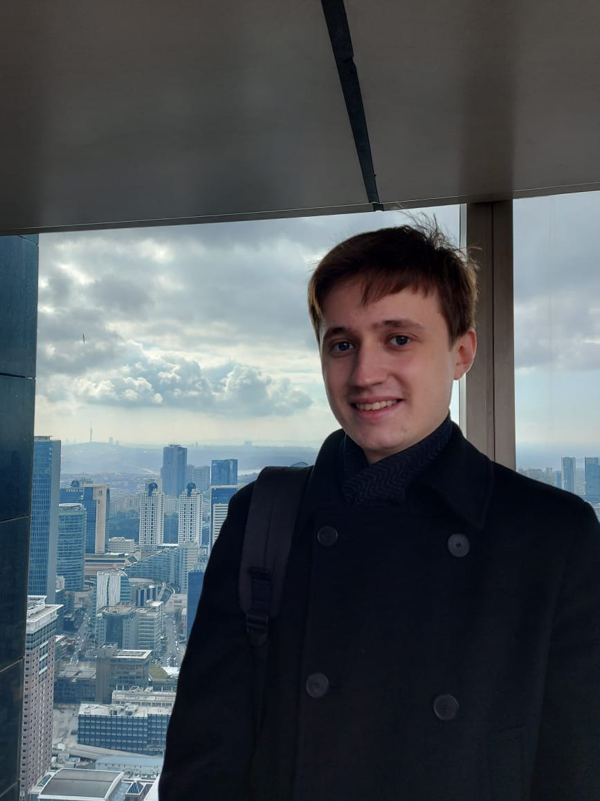

## About me

I am a first year PhD student at the [Max Planck Institute for Mathematics in the Sciences](https://www.mis.mpg.de/) in Leipzig under the supervision of [Bernd Sturmfels](https://math.berkeley.edu/~bernd/) and [Simon Telen](https://simontelen.webnode.page/). Before that, I was a masters student at Moscow State University, where my advisors were [Gleb Pogudin](http://www.lix.polytechnique.fr/Labo/Gleb.POGUDIN/) and Yury Razmyslov. I am broadly interested in applied algebra with a particular interest in differential algebra and real algebraic geometry.

Here is my [CV](https://dmmpavlov.github.io/CV_Pavlov_March_2023.pdf).

My e-mail is [pavlov@mis.mpg.de](mailto:pavlov@mis.mpg.de)

## List of publications
* [On real and observable realizations of input-output equations](https://arxiv.org/abs/2303.16799) (with Sebastian Falkensteiner and J. Rafael Sendra), arXiv:2303.16799, 2023.
* [Logarithmically Sparse Symmetric Matrices](https://arxiv.org/abs/2301.10042), arXiv:2301.10042, 2023.
* [Gibbs Manifolds](https://arxiv.org/abs/2211.15490) (with Bernd Sturmfels and Simon Telen), arXiv:2211.15490, 2022.
* [On realizing differential-algebraic equations by rational dynamical systems](https://doi.org/10.1145/3476446.3535492) (with Gleb Pogudin), ACM International Symposium on Symbolic and Algebraic Computation
(ISSAC), 2022. [Preprint](https://arxiv.org/abs/2203.03555)
* [From algebra to analysis: new proofs of theorems by Ritt and Seidenberg](https://doi.org/10.1090/proc/16065) (with Gleb Pogudin and Yury Razmyslov), Proceedings of the American Mathematical Society, 2022. [Preprint](https://arxiv.org/abs/2107.03012)
