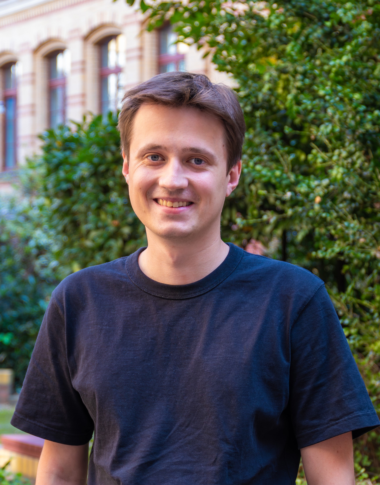

## About me

I am a postdoctoral reseracher in the [Real Algebraic Geometry group](https://tu-dresden.de/mn/math/geometrie/kummer/startseite/?set_language=en) of [Mario Kummer](https://tu-dresden.de/mn/math/geometrie/kummer/die-professur/inhaber-in) at [TU Dresden](https://tu-dresden.de). I did my PhD at the [Max Planck Institute for Mathematics in the Sciences](https://www.mis.mpg.de) under the supervision of [Bernd Sturmfels](https://math.berkeley.edu/~bernd/) and [Simon Telen](https://simontelen.webnode.page/). Before that, I was a student at Moscow State University, where my advisors were [Gleb Pogudin](http://www.lix.polytechnique.fr/Labo/Gleb.POGUDIN/) and Yury Razmyslov. I am primarily interested in positive geometry, real algebraic geometry and their applications to physics. My other mathematical interests include differential algebra and algebraic combinatorics.

Here is my [CV](https://dmmpavlov.github.io/CV_Pavlov_Mar25.pdf). You can also view my [Google Scholar](https://scholar.google.com/citations?user=VwCmjKwAAAAJ) and [ORCID](https://orcid.org/0009-0002-0116-4659) pages.

My e-mail is [pavlov@mis.mpg.de](mailto:pavlov@mis.mpg.de)

## Preprints
* [Adjoints of Polytopes: Determinantal Representations and Smoothness](https://arxiv.org/abs/2507.01672) (with Clemens Brüser and Mario Kummer), arXiv:2507.01672, 2025. 
* [Positive Polytopes with Few Facets in the Grassmannian](https://arxiv.org/abs/2503.01652) (with Kristian Ranestad), arXiv:2503.01652, 2025.
* [Combinatorics of *m*=1 Grasstopes](https://arxiv.org/abs/2307.09603) (with Yelena Mandelshtam and Elizabeth Pratt), arXiv:2307.09603, 2023. To appear in *Combinatorial Theory*.

## Published articles
* [Algebraic Geometry of Quantum Graphical Models](https://www.sciencedirect.com/science/article/pii/S0196885825000922) (with Eliana Duarte and Maximilian Wiesmann), *Advances in Applied Mathematics*, 2025. [Preprint](https://arxiv.org/abs/2308.11538)
* [From Feynman Diagrams to the Amplituhedron: A Gentle Review](https://lematematiche.dmi.unict.it/index.php/lematematiche/article/view/2735/1228) (with Shounak De, Marcus Spradlin and Anastasia Volovich), *Special volume on Positive Geometry, Le Matematiche*, 2025. [Preprint](https://arxiv.org/abs/2410.11757)
* [Hyperplane Arrangements in the Grassmannian](https://lematematiche.dmi.unict.it/index.php/lematematiche/article/view/2729/1235) (with Elia Mazzucchelli and Kexin Wang), *Special volume on Positive Geometry, Le Matematiche*, 2025. [Preprint](https://arxiv.org/abs/2409.04288)
* [On real and observable rational realizations of input-output equations](https://doi.org/10.1016/j.sysconle.2025.106059) (with Sebastian Falkensteiner and J. Rafael Sendra), *Systems and Control Letters*, 2025. [Preprint](https://arxiv.org/abs/2303.16799) 
* [Santaló Geometry of Convex Polytopes](https://doi.org/10.1137/24M1643566) (with Simon Telen), *SIAM Journal on Applied Algebra and Geometry*, 2025. [Preprint](https://arxiv.org/abs/2402.18955)
* [Gibbs Manifolds](https://doi.org/10.1007/s41884-023-00111-2) (with Bernd Sturmfels and Simon Telen), *Information Geometry*, 2024. [Preprint](https://arxiv.org/abs/2211.15490)
* [Logarithmically Sparse Symmetric Matrices](https://doi.org/10.1007/s13366-024-00753-y), *Beiträge zur Algebra und Geometrie*, 2024. [Preprint](https://arxiv.org/abs/2301.10042)
* [On realizing differential-algebraic equations by rational dynamical systems](https://doi.org/10.1145/3476446.3535492) (with Gleb Pogudin), *ACM International Symposium on Symbolic and Algebraic Computation
(ISSAC)*, 2022. [Preprint](https://arxiv.org/abs/2203.03555)
* [From algebra to analysis: new proofs of theorems by Ritt and Seidenberg](https://doi.org/10.1090/proc/16065) (with Gleb Pogudin and Yury Razmyslov), *Proceedings of the American Mathematical Society*, 2022. [Preprint](https://arxiv.org/abs/2107.03012)
