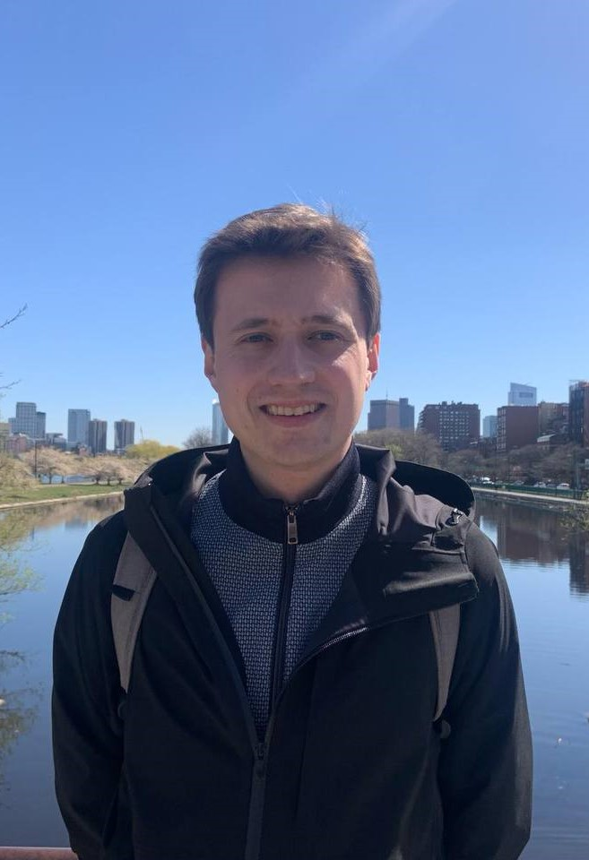

## About me

I am a second year PhD student at the [Max Planck Institute for Mathematics in the Sciences](https://www.mis.mpg.de/) in Leipzig under the supervision of [Bernd Sturmfels](https://math.berkeley.edu/~bernd/) and [Simon Telen](https://simontelen.webnode.page/). Before that, I was a masters student at Moscow State University, where my advisors were [Gleb Pogudin](http://www.lix.polytechnique.fr/Labo/Gleb.POGUDIN/) and Yury Razmyslov. I am primarily interested in real algebraic geometry and its applications to physics, in particular, to quantum information and particle scattering. My other mathematical interests include differential algebra and algebraic combinatorics.

Here is my [CV](https://dmmpavlov.github.io/CV_Pavlov_May24.pdf). You can also view my [Google Scholar](https://scholar.google.com/citations?user=VwCmjKwAAAAJ) and [ORCID](https://orcid.org/0009-0002-0116-4659) pages.

My e-mail is [pavlov@mis.mpg.de](mailto:pavlov@mis.mpg.de)

## Preprints
* [Santaló Geometry of Convex Polytopes](https://arxiv.org/abs/2402.18955) (with Simon Telen), arXiv:2402.18955, 2024.
* [Algebraic Geometry of Quantum Graphical Models](https://arxiv.org/abs/2308.11538) (with Eliana Duarte and Maximilian Wiesmann), arXiv:2308.11538, 2023.
* [Combinatorics of *m*=1 Grasstopes](https://arxiv.org/abs/2307.09603) (with Yelena Mandelshtam and Elizabeth Pratt), arXiv:2307.09603, 2023.
* [On real and observable realizations of input-output equations](https://arxiv.org/abs/2303.16799) (with Sebastian Falkensteiner and J. Rafael Sendra), arXiv:2303.16799, 2023.
## Published articles
* [Logarithmically Sparse Symmetric Matrices](https://doi.org/10.1007/s13366-024-00753-y), *Beiträge zur Algebra und Geometrie*, 2024. [Preprint](https://arxiv.org/abs/2301.10042)
* [Gibbs Manifolds](https://doi.org/10.1007/s41884-023-00111-2) (with Bernd Sturmfels and Simon Telen), *Information Geometry*, 2023. [Preprint](https://arxiv.org/abs/2211.15490)
* [On realizing differential-algebraic equations by rational dynamical systems](https://doi.org/10.1145/3476446.3535492) (with Gleb Pogudin), *ACM International Symposium on Symbolic and Algebraic Computation
(ISSAC)*, 2022. [Preprint](https://arxiv.org/abs/2203.03555)
* [From algebra to analysis: new proofs of theorems by Ritt and Seidenberg](https://doi.org/10.1090/proc/16065) (with Gleb Pogudin and Yury Razmyslov), *Proceedings of the American Mathematical Society*, 2022. [Preprint](https://arxiv.org/abs/2107.03012)
